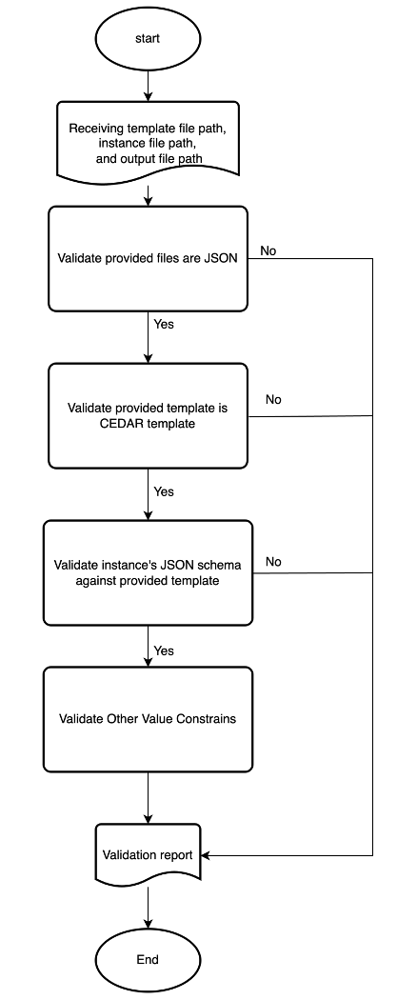
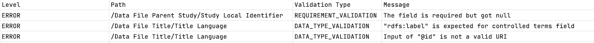

# RADx Metadata Validator

## Overview
The RADx Metadata Validator is a command line tool designed to validate RADx metadata instance against metadata template. This validator operates at four distinct levels to ensure comprehensive and accurate validation. It ensures that the metadata instances adhere to the standards defined in the RADx Metadata Template, which can be found at the [RADx Metadata Specification Docs](https://radx.github.io/radx-metadata-specification-docs/).

## Validation Workflow
Below is the workflow of RADx Metadata Validator:



### Input Specification
The RADx Metadata Validator accepts the following command line arguments:

- `template` (Required): The file path to the metadata template file.
- `instance` (Required): The file path to the metadata instance file that needs to be validated.
- `data` (Optional): CSV data file name described by the metadata instance.
- `dict` (Optional): CSV data dictionary file name.
- `sha256` (Optional): SHA256 digest value of data file.
- `out` (Optional): The file path where the validation report will be saved. If not provided, the validation report will be printed out to the console.

For example:

```
java -jar radx-metadata-validator-app-1.0.0.jar 
--template validationFiles/RADxTemplate.json 
--instance validationFiles/RADxInstance.json 
--data COVID-19_Booster_Shot_June_2022_Responses.csv
--dict COVID-19_Booster_Shot_June_2022_Responses--DICT.csv
--sha256 ebff8d3da88b292622d3bfc36bdac4c4537ddc56cb07f344c5223d6b6f9cd011
--out output.csv
```
**Data File Metadata Specification can be downloaded [here](https://github.com/bmir-radx/radx-metadata-validator/releases/download/v1.0.6/RADxMetadataSpecification.json
)**

### Usage
#### The validator can be executed through jar file.
You can download the radx-metadata-validator-app jar file [here](https://github.com/bmir-radx/radx-metadata-validator/releases/download/v1.0.6/radx-metadata-validator-app-1.0.6.jar).

Once downloaded, navigate to the folder where the jar file is located. Then, run the jar file using the following command:

```bash
java -jar radx-metadata-validator-app-1.0.6.jar 
  --template validationFiles/RADxTemplate.json 
  --instance validationFiles/RADxInstance.json 
  --out output.csv
```

#### The validator can be executed through Maven's `exec:java` goal. 
Follow the steps below to validate your metadata instances:
1. **Navigate to the Application Directory**

   First, clone the repo and navigate to the `radx-metadata-validator-app` directory within the `radx-metadata-validator` project folder:

   ```
   cd radx-metadata-validator-app
   ```

2. **Validate Metadata Instance**

   To validate your metadata instances against a CEDAR template stored in a file, use the following Maven command. You need to specify the paths to your template file, instance file, and the output file where validation report will be saved:

   ```
   mvn exec:java 
     -Dexec.args="--template <template_file_path> 
                  --instance <instance_file_path> 
                  --out <validation_report_path>"
    ```

   e.g.,

    ```
    mvn exec:java 
     -Dexec.args="--template ../../RADxTemplate.json
                  --instance ../../RADxExampleMetadataInstance.json 
                  --out ../../Output.csv"
    ```

#### To use the Radx Metadata Validator Library
Add the following Maven dependency:
```xml
<dependency>
    <groupId>edu.stanford.bmir.radx</groupId>
    <artifactId>radx-metadata-validator-lib</artifactId>
    <version>1.0.6</version>
</dependency>
```
The Radx Metadata Validator Library can be used with Spring Boot by scanning components in the library:
```java
@ComponentScan(basePackages = "edu.stanford.bmir.radx.metadata.validator")
```
#### Example Implementation
Use the ValidatorFactory to create a validator instance. This is achieved by invoking the createValidator method and passing it the LiteralFieldValidators object. This method orchestrates the various components and prepares the validator for execution.

```java
@Component
public class Example {
  private final ValidatorFactory validatorFactory;

  public Example(ValidatorFactory validatorFactory) {
    this.validatorFactory = validatorFactory;
  }

  public void doValidation(Path template, Path instance, String sha256, String data, String dict){
    var validator = validatorFactory.createValidator(getLiteralFieldValidatorsComponent(sha256, data, dict));
    String templateContent = Files.readString(template);
    String instanceContent = Files.readString(instance);
    var report = validator.validateInstance(templateContent, instanceContent);
  }
  
  private LiteralFieldValidators getLiteralFieldValidatorsComponent(String sha256, String data, String dict){
    var map = new HashMap<FieldPath, LiteralFieldValidator>();
    if(sha256 != null){
      String errorMessage = String.format("Expected SHA256 digest equals to %s", sha256);
      String warningMessage = String.format("Expected SHA256 digest equals to %s, but an empty value is received.", sha256);
      var constantValueFieldValidator = new ConstantValueFieldValidator(sha256, errorMessage, warningMessage);
      map.put(RADxSpecificFieldPath.SHA256_DIGEST.getFieldPath(), constantValueFieldValidator);
    }

    if(data != null){
      String errorMessage = String.format("Expected File Name equals to %s", data);
      String warningMessage = String.format("Expected File Name equals to %s, but an empty value is received.", data);
      var constantValueFieldValidator = new ConstantValueFieldValidator(data, errorMessage, warningMessage);
      map.put(RADxSpecificFieldPath.FILE_NAME.getFieldPath(), constantValueFieldValidator);
    }

    if(dict != null){
      String errorMessage = String.format("Expected Data Dictionary File Name equals to %s", dict);
      String warningMessage = String.format("Expected Data Dictionary File Name equals to %s, but an empty value is received.", dict);
      var constantValueFieldValidator = new ConstantValueFieldValidator(dict, errorMessage, warningMessage);
      map.put(RADxSpecificFieldPath.DATA_DICT_FILE_NAME.getFieldPath(), constantValueFieldValidator);
    }

    return new LiteralFieldValidators(map);
  }
}
```

### JSON File Validation
- Validates that the provided files are in proper JSON format. This is a preliminary check to ensure that the files are syntactically correct as per JSON standards.

### CEDAR Template Validation
- Validates that the provided template file is a CEDAR (Center for Expanded Data Annotation and Retrieval) compliant template. This step ensures that the template follows the specific structure and standards required by CEDAR.

### Schema Validation Against Template
- Validates that the schema of the provided instance matches the schema defined in the template.
- This level of validation ensures that the metadata instance aligns structurally with the template.

### Value Constraint Validation
- Validates other value constraints, which include:
    - Required value validation: Checks that all required data fields are present.
    - Data type validation: Ensures that the data types of the values in the metadata instance match those specified in the template.
    - Cardinality validation: Verifies that the quantity of element instances or field instances adheres to the specified minimum and maximum limits.

### Output File Format
The output of the RADx Metadata Validator is a CSV file with the following format:

- **Level**: Indicates the level of validation message, which can be either `ERROR` or `WARNING`.
- **Path**: Specifies the location within the file where the validation issue was found.
- **Validation Type**: Specifies which validation step (e.g., JSON Validation, CEDAR Model Validation, Schema Validation, Requirement Validation, Data Type Validation) generated the message.
- **Message**: Describes the validation error or warning message.



